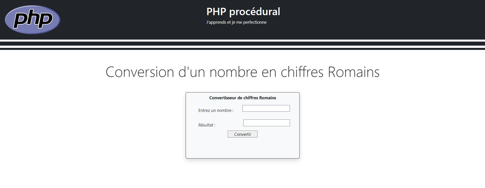
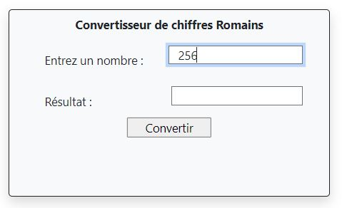
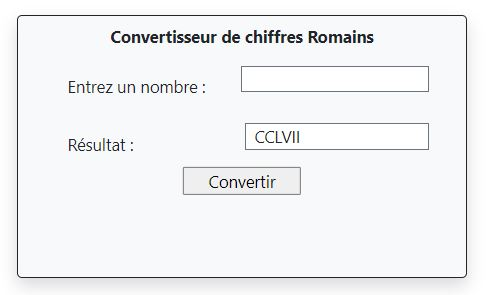
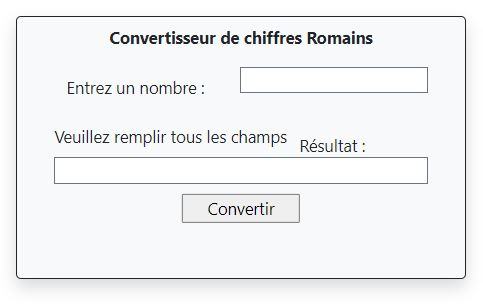

# CONVERTISSEUR
Programme PHP : Convertisseur des nombres en chiffres Romain.  

* Vous devez utiliser la méthode "POST"  
* Vérifier si "input" est vide, si oui un message s'affiche  

     

Convertisseur des nombres en chiffre Romain
&nbsp;&nbsp;   

&nbsp;&nbsp;&nbsp;&nbsp;   

Si c'est vide un message s'affiche  
&nbsp;&nbsp; 
 

